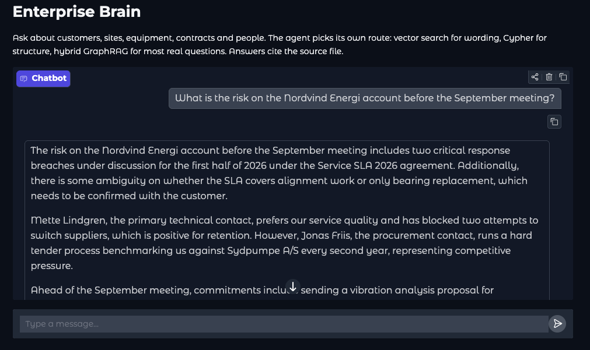
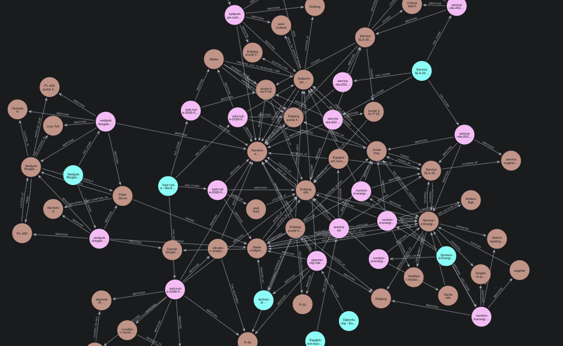

# Enterprise Brain — GraphRAG prototype

<table>
<tr>
<td width="50%"></td>
<td width="50%"></td>
</tr>
<tr>
<td align="center"><em>The agent, answering from both stores</em></td>
<td align="center"><em>The open-schema graph it queries</em></td>
</tr>
</table>

Markdown in, one memory out: **Qdrant** for meaning, **Neo4j** for structure, a Microsoft Agent
Framework agent on **OpenAI** that can use either, and a Gradio UI on top.

```
data/raw/*.md
      │
      ├─ chunk ──► embed ──────────────► Qdrant   (payload carries chunk_id + file path)
      │
      └─ chunk ──► LLM open-schema ────► Neo4j    (:Document)-[:HAS_CHUNK]->(:Chunk)-[:MENTIONS]->(:Entity)
                   extraction                      (:Entity)-[:ANY_TYPE {evidence, chunk_id}]->(:Entity)

                              chunk_id is the join between the two stores
```

## Prerequisites

- Docker (for Neo4j + Qdrant)
- [uv](https://docs.astral.sh/uv/)
- An OpenAI API key

## Run it

```bash
cp .env.example .env          # fill in OPENAI_API_KEY and NEO4J_PASSWORD
docker compose up -d neo4j qdrant

uv sync
uv run jupyter lab notebooks/enterprise_brain.ipynb
```

Neo4j browser: <http://localhost:7474> (`neo4j` / value of `NEO4J_PASSWORD`).
Qdrant dashboard: <http://localhost:6333/dashboard>.

The notebook runs ingestion, shows Cypher and RAG side by side, builds the agent and launches Gradio.
To run the UI as a service instead: `docker compose --profile app up -d rag` → <http://localhost:7860>.

## Models

One OpenAI key covers both jobs: `CHAT_MODEL` (default `gpt-4.1-mini`) for the agent and for
entity extraction, `EMBEDDING_MODEL` (default `text-embedding-3-small`, 1536 dims) for the vectors.

Extraction is one chat call per chunk, so the chat model is where cost and quality trade off —
`gpt-4.1` gives noticeably cleaner entity types on messy documents. `EMBEDDING_DIM` must match the
embedding model, and changing either means re-ingesting with `reset=True`.

Embeddings can be moved elsewhere without touching chat: uncomment `EMBEDDINGS_BASE_URL` and
`EMBEDDINGS_API_KEY` in `.env` to point them at Azure OpenAI, a local text-embeddings-inference
server, or Ollama (`http://localhost:11434/v1`, `nomic-embed-text`, `EMBEDDING_DIM=768`).

## Layout

| Path | What it is |
|---|---|
| `.env.example` | Environment template — `cp .env.example .env` and fill in |
| `data/raw/` | Seven sample markdown files, see below |
| `src/brain/config.py` | All environment configuration |
| `src/brain/clients.py` | Neo4j driver, Qdrant client, OpenAI chat, embeddings |
| `src/brain/ingest.py` | Markdown → chunks → vectors + open-schema graph |
| `src/brain/retrieval.py` | `vector_search`, `run_cypher`, `neighbourhood`, `hybrid_context` |
| `src/brain/agent.py` | Agent Framework `Agent` with four tools |
| `src/brain/ui.py` | Gradio chat |
| `notebooks/enterprise_brain.ipynb` | The guided walkthrough |
| `docker-compose.yaml` | Neo4j + Qdrant, plus an optional `rag` service (`--profile app`) |
| `Dockerfile` | Image for the `rag` service |

## The sample corpus

`data/raw/` holds seven files built so the interesting answers need two or three of them at once —
that is the argument for the graph, made in data. Every company, person and account below is
fictional, invented for this demo.

| File | Stands in for | Key content |
|---|---|---|
| `nordvind-energi-account.md` | CRM export | Nordvind Energi A/S, SAP number, contacts Mette Lindgren and Jonas Friis, two sites |
| `visit-note-2026-08-14.md` | Field notes from a customer interview | Vibration alarms on P-40, Mette suspects alignment, Q4 retrofit budget, three commitments we made |
| `service-sla-2026.md` | Contract repository | SLA-2026-0142 — covers bearings, **excludes alignment work**, 8 hour critical response |
| `asset-p40.md` | SAP equipment record | EQ-40118, no variable frequency drive, no permanent vibration sensor, service history |
| `opportunity-retrofit-q4.md` | CRM opportunity | 2.8 MDKK Q4 retrofit, Sydpumpe competing, spec due mid September |
| `bakkedal-biogas-account.md` | Second customer, CRM | Same symptom on the same pump model — root cause was foundation resonance, fixed by re-grouting |
| `sydpumpe-competitor.md` | Internal wiki | Competitor profile, no 8 hour response north of Kolding |

Three questions that need the joins:

1. *Does the SLA cover what is actually wrong with P-40?* → visit note (alignment) + contract (alignment excluded).
2. *Have we seen this before?* → Nordvind's visit note + **a different customer's** file. Pure vector RAG rarely reaches this one.
3. *What is the risk before September?* → visit note + opportunity + competitor profile + SLA breaches.

Drop your own markdown into `data/raw/` and re-run section 5 with `reset=True`; nothing in the code
knows about these specific files.

## The graph model

Open schema: the extraction prompt lets the model choose entity labels and relationship types, with
consistency rules rather than a fixed ontology. Every entity also gets the generic `:Entity` label and
a normalised `key`, so Cypher works without knowing the invented labels.

Every edge stores `evidence` and the `chunk_id` it came from, which is what makes provenance queries
(section 7.3 of the notebook) possible.

## Known rough edges

- **Schema drift.** Open schema means the same concept can arrive as `Company` in one chunk and
  `Organisation` in another. The notebook's last section describes two fixes.
- **Entity resolution is string based.** "Mette Lindgren" and "Mette L." become two nodes — the same
  physical asset can end up as several nodes if the model names it differently across chunks.
- **One LLM call per chunk** at ingestion. Fine for seven files, not for seven thousand — batch the
  chunks per document before scaling up.
- **No access control yet.** Every query sees everything.

## License

MIT — see [LICENSE](LICENSE).
